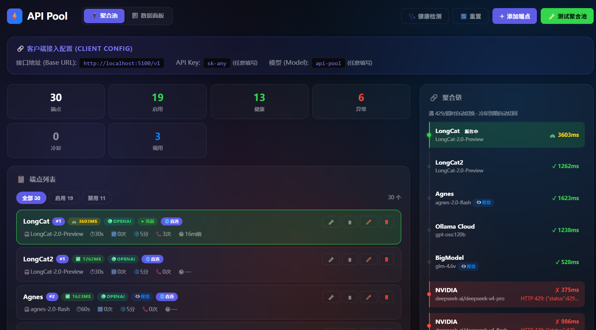
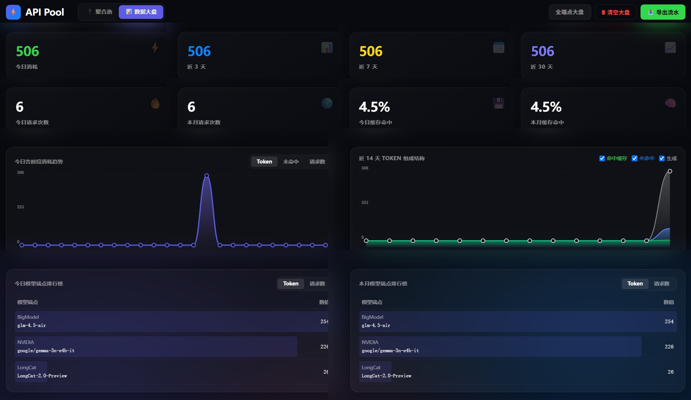
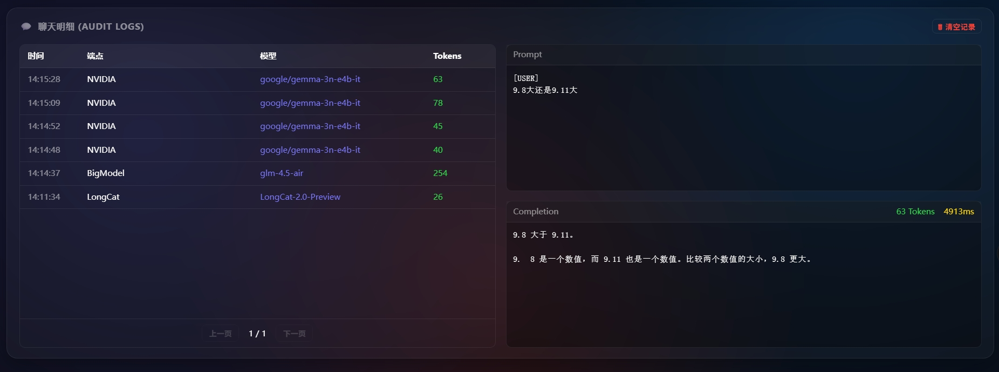
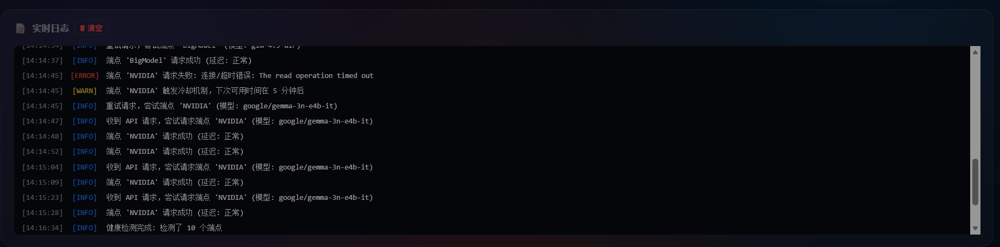
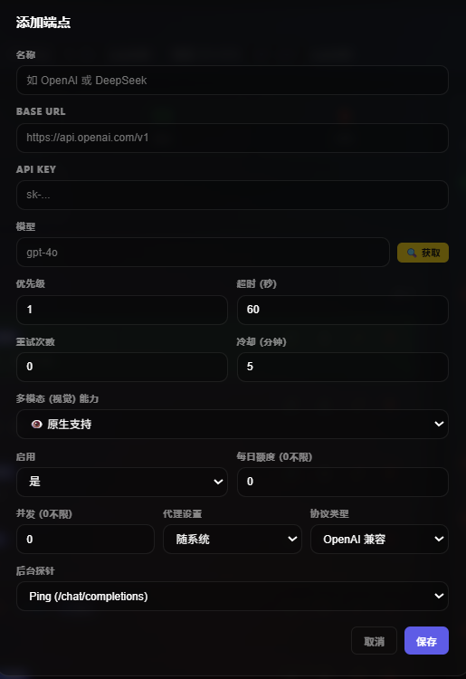
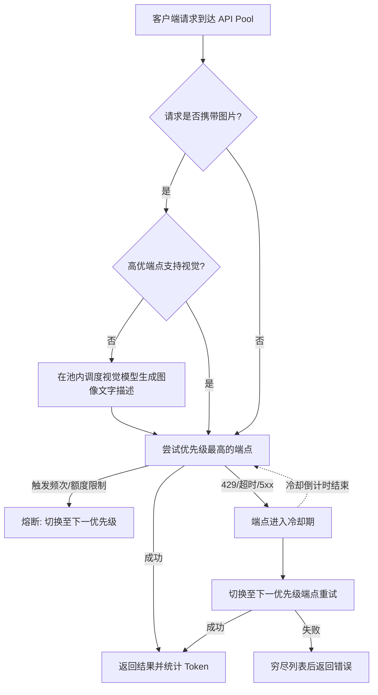

# ⚡ API Pool

一个极致轻量、现代化、零依赖的 API 聚合管理面板与高可用网关。
专为大模型 API 设计，支持多端点自动无缝切换、健康检测、模型优先级管理、多模态智能转译、以及详细的数据全景大盘。

   

---

## 📸 界面预览 (Screenshots)

- **控制台主页 (Dashboard):**
  
- **数据大盘 (Analytics):**
  
- **聊天明细溯源 (Audit Logs):**
  
- **实时调度日志 (System Logs):**
  
- **端点细粒度配置 (Endpoint Config):**
  

---

## ✨ 核心亮点 (Features)

- 🛡️ **智能健康探针**：
  内置周期性健康检测雷达。支持为不同接口设置「零成本探测模式」或「高优免扰模式」，精确捕获延迟与可用性，避免对计费接口造成探测损耗。
- 🏆 **全自动优先级编排**：
  基于真实客观指标（如 LMSYS Elo 积分）动态评估模型能力，决定 API 调用顺位，确保把复杂请求永远抛给最强大脑。
- 🔁 **企业级高可用切换链路**：
  当某个节点触发 `429 Too Many Requests`、`5xx` 服务端崩溃、或网络级连接超时，系统将在几毫秒内无缝熔断并切换至下一个可用备用节点。进入「冷却期」的端点在恢复后将自动回归。
- 👁️ **智能多模态视觉转译 (Vision Translation)**：
  如果客户端发送了携带图片的多模态请求，但命中的高优端点不支持视觉能力（如纯文本模型），系统将自动从池内**调度带视觉能力的模型**（如 GPT-4o, GLM-4V）执行前置图像解析任务。解析后的详细文字描述将被天衣无缝地拼接到上下文中，进而继续传递给纯文本模型处理。
- 🔌 **全双工异构协议兼容**：
  原生支持 OpenAI 协议与 Anthropic (Claude) 协议。无论后台挂载什么模型，客户端仅需面对统一的标准化 OpenAI 接口。
- 📊 **极客级数据大盘 (Data Analytics)**：
  自带类似 Vercel / Grafana 的现代玻璃拟物化 (Glassmorphism) 统计面板。基于底层 SQLite 数据库持久化，记录每一枚 Token 的生与死（缓存命中、生成、流失）。
- 💬 **审计日志追踪 (Audit Logs)**：
  每一条流经网关的 Prompt 与 Completion 都会被截获并脱敏记录（默认屏蔽 Base64 图片以节省空间）。即便是后台触发的「视觉转译子任务」也同样受 Token 追踪和日志审计。
- 🗂️ **情景化悬浮测试舱 (Contextual Test Drawer)**：
  原生集成极简风交互体验，丢弃臃肿的静态面板，采用右下角按需唤出的玻璃态悬浮抽屉进行端点连通性测试及图片视觉测试。
- 📦 **纯原生 零依赖**：
  无需繁杂的 `pip install`，只需安装了标准的 Python 环境，单文件即可驱动整个复杂的高并发应用系统。

## 🚀 快速开始 (Quick Start)

### 1. 下载或克隆仓库
```bash
git clone https://github.com/thvse/api-pool.git
cd api-pool
```

### 2. 启动服务
无需安装任何三方库，直接运行：
```bash
python api_pool_server.py
```

### 3. 访问面板
打开浏览器，访问图形化控制台：
👉 **[http://localhost:5100](http://localhost:5100)**

*(默认对外 API 接口 Base URL 为 `http://localhost:5100/v1`，API Key 可任意填写)*

---

## ⚙️ 网关切换逻辑 (Failover Logic)



## 🔌 API 接口清单

如果你希望通过代码管控 API Pool，我们提供了详尽的 REST API 接口：

| 方法 | 路径 | 描述 |
|------|------|------|
| **GET** | `/api/endpoints` | 读取所有的端点配置与健康状况 |
| **POST** | `/api/endpoints` | 动态新增一个 API 端点 |
| **DELETE**| `/api/endpoints/<id>` | 移除指定的 API 端点 |
| **POST** | `/api/test-pool` | 手动模拟发包测试聚合池可用性 |
| **POST** | `/api/test` | 绕过聚合机制，指定测试池内某个具体的端点 |
| **POST** | `/api/health-check` | 全局触发健康探针雷达扫描 |
| **GET** | `/api/token-stats` | 提取结构化的全盘数据统计概览 |
| **GET** | `/api/chat-logs` | 拉取最新的请求流转与对话明细 |
| **DELETE**| `/api/logs` / `/api/token-stats` | 销毁或清空内存与 SQLite 记录数据 |

## 📜 许可证 (License)

本项目采用 **MIT License**，欢迎任意魔改与分发。
