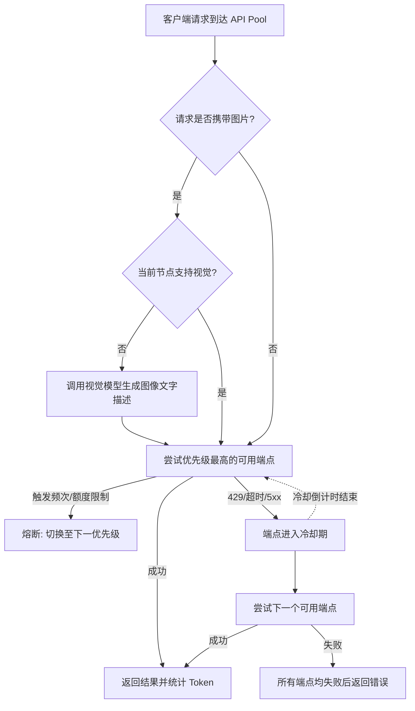

# ⚡ API Pool

一个轻量、零依赖的 API 聚合管理面板与网关。
支持大模型 API 的多端点自动切换、健康检测、模型优先级调度、图片自动预处理，并提供数据统计面板。

   

---

## 📸 界面预览 (Screenshots)

- **控制台主页 (Dashboard):**
  
- **统计大盘 (Analytics):**
  
- **对话日志 (Audit Logs):**
  
- **系统日志 (System Logs):**
  
- **端点配置 (Endpoint Config):**
  

---

## ✨ 核心功能 (Features)

- 🛡️ **自动健康检查**：
  内置周期性连通性检测。支持为不同接口设置“零成本探测”或“免打扰模式”，获取延迟情况，避免对计费接口造成消耗。
- 🏆 **优先级自动调度**：
  可根据需要为模型分配优先级，确保复杂的请求优先分配给能力更强的模型处理。
- 🔁 **故障自动切换**：
  当某个节点触发 `429 Too Many Requests`、`5xx` 错误或连接超时，系统将自动熔断并切换至下一个可用节点。进入冷却期的端点在恢复后将自动重新启用。
- 👁️ **自动处理图片请求 (Vision Translation)**：
  如果客户端发送了携带图片的请求，但当前节点不支持视觉能力（如纯文本模型），系统会自动调用支持视觉的模型（如 GPT-4o, GLM-4V）进行图像解析。解析出的文字描述将自动追加到上下文中，供纯文本模型继续处理。控制台列表支持通过 UI 徽章直观显示节点的视觉支持状态。
- 🔌 **多协议兼容**：
  支持 OpenAI 协议与 Anthropic (Claude) 协议。无论后台使用什么模型，对外均提供标准的 OpenAI 接口格式。
- 📊 **统计大盘 (Data Analytics)**：
  提供类似玻璃拟物化 (Glassmorphism) 风格的统计面板。基于底层 SQLite 数据库持久化，记录 Token 的消耗情况（缓存命中、生成、流失）。
- 💬 **日志追踪 (Audit Logs)**：
  所有经过网关的 Prompt 与 Completion 均会被脱敏记录（默认屏蔽 Base64 图片以节省空间）。后台触发的图像解析任务同样会进行 Token 统计和日志记录。
- 🗂️ **悬浮测试面板 (Test Drawer)**：
  界面右下角提供按需唤出的悬浮抽屉，可进行端点连通性及图片解析测试，支持无缝切换端点并覆盖测试信息。
- 📦 **纯原生 零依赖**：
  无需繁杂的 `pip install`，在标准的 Python 3.10+ 环境下，单文件即可运行。

## 🚀 快速开始 (Quick Start)

### 1. 下载或克隆仓库
```bash
git clone https://github.com/thvse/api-pool.git
cd api-pool
```

### 2. 启动服务
无需安装任何三方库，直接运行：
```bash
python api_pool_server.py
```

### 3. 访问面板
打开浏览器，访问图形化控制台：
👉 **[http://localhost:5100](http://localhost:5100)**

*(默认对外 API 接口 Base URL 为 `http://localhost:5100/v1`，API Key 可任意填写)*

---

## ⚙️ 故障切换逻辑 (Failover Logic)



## 🔌 API 接口清单

如果你希望通过代码管理 API Pool，我们提供了 REST API 接口：

| 方法 | 路径 | 描述 |
|------|------|------|
| **GET** | `/api/endpoints` | 读取所有端点配置与健康状况 |
| **POST** | `/api/endpoints` | 新增 API 端点 |
| **DELETE**| `/api/endpoints/<id>` | 移除指定 API 端点 |
| **POST** | `/api/test-pool` | 测试聚合池整体可用性 |
| **POST** | `/api/test` | 测试指定的单一端点 |
| **POST** | `/api/health-check` | 触发一次全局健康检查 |
| **GET** | `/api/token-stats` | 获取数据统计概览 |
| **GET** | `/api/chat-logs` | 获取最新的对话与请求日志 |
| **DELETE**| `/api/logs` / `/api/token-stats` | 清空对应的数据记录 |

## 📜 许可证 (License)

本项目采用 **MIT License**。
